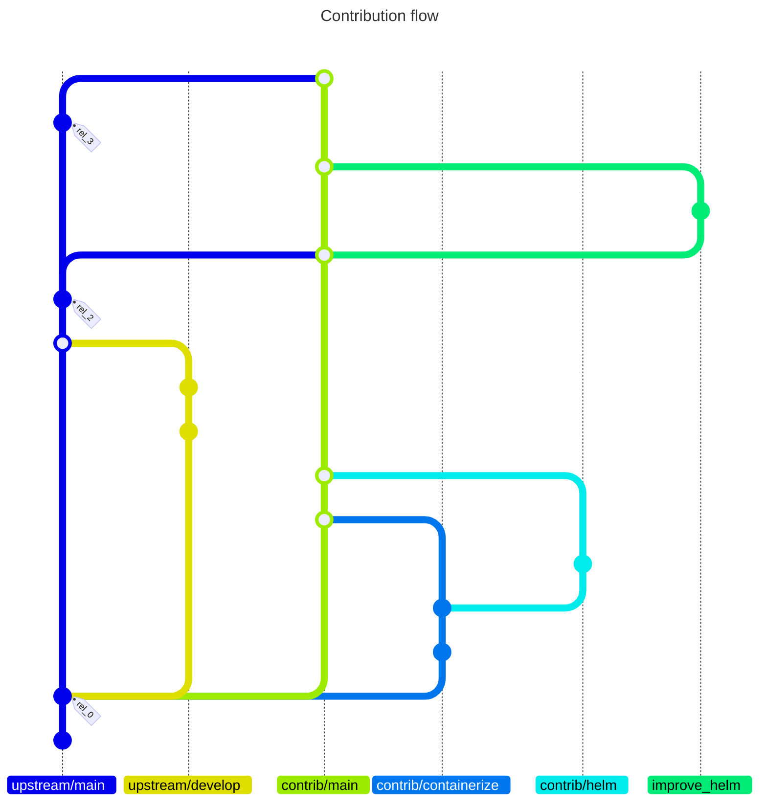

# Branching strategy

Branching, merging and versioning strategy to follow *upstream* changes while
maintaining *multiple* own contributions.

*Upstream* changes may include:
- changes (development updates, stable updates, releases) of upstream content
- updates of infrastructure, e.g. used container base images

*Contributions* may include:
- fixes, improvements, modernization of upstream: Could in principle be included
  into upstream without changing the scope of upstream
- containerization
- composition, deployment

*Branching and merging* and in particular the direction of branching and
merging, must take the implied dependency of one branch on another into account.
Branching out from another branch implies a dependency of the branched-out
branch on its source branch. Similarly, when merging a branch into another, the
'receiving' branch becomes dependent of the branch that is merged into it. For
long-lived branches, the directions of the dependencies implied by branching and
merging should coincide with the direction of content and of functionality.

E.g.: The Dockerfile of an application and the image built from it clearly
depends on the application itself, but the application does not (and should not)
depend on the Dockerfile or the image. Accordingly, if/while the Dockerfile for
an application is maintained on a separate branch, in a separate fork of the
repository, even in that fork the branch containing the dockerfile should not be
merged into the main application branch, to keep the application code
independent ('unpoluted') of the dockerfile.

Also among contributions that originate and are managed in the same repository,
the same rules apply. A helm chart, which requires container images may be
developed on a branch that branched out from the mainteneance branch of the
Dockerfile, and it may and should pull in updates from the Dockerfile-branch,
but not the other way around.

> mermaid git diagram syntax: https://mermaid.ai/open-source/syntax/gitgraph.html

